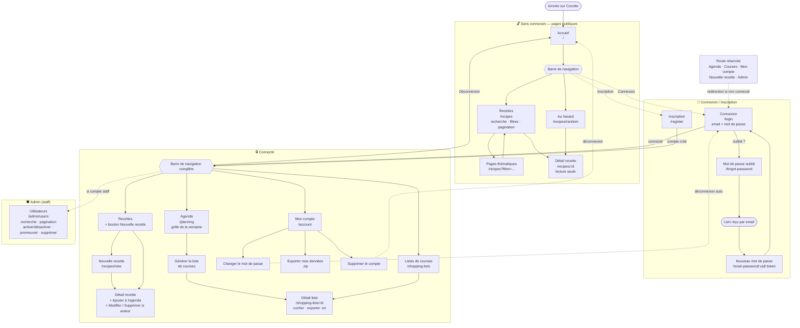

# Cocotte

Application de gestion de recettes : page d'accueil (dernières recettes, pages thématiques),
recherche par ingrédients/saison/régime/temps, tirage d'une recette au hasard, menu de la
semaine avec suivi nutritionnel (utile pour une transition vegan), génération de listes de
courses, import manuel ou depuis une URL (avec récupération automatique de l'image), export PDF
(recette ou agenda de la semaine), image/vidéo/source par recette. Backend Django/DRF, frontend
Vue 3 — interface traduite (FR/EN) et responsive (mobile-first, navigation par barre d'onglets
en bas d'écran).

## Lancer en local (Docker)

```bash
cp backend/.env.example backend/.env
docker compose up --build
```

- API : `http://localhost:8000/api/`, admin : `http://localhost:8000/admin/`
- Frontend : `http://localhost:5173/`

## Déploiement en production (Docker + Caddy)

`docker-compose.prod.yml` construit des images de production (backend servi par Gunicorn,
frontend buildé en fichiers statiques) et lance un conteneur Caddy en frontal qui obtient et
renouvelle automatiquement un certificat HTTPS (Let's Encrypt) pour le domaine fourni, sert la
SPA, et fait reverse proxy vers le backend pour `/api/`, `/admin/`, `/static/` et `/media/`.

Prérequis : un serveur avec Docker + Docker Compose, un nom de domaine dont l'enregistrement
DNS (A/AAAA) pointe déjà vers ce serveur, et les ports 80/443 ouverts.

```bash
cp .env.prod.example .env.prod
# Éditer .env.prod : DOMAIN, ACME_EMAIL, DJANGO_SECRET_KEY, POSTGRES_PASSWORD (+ le
# reporter dans DATABASE_URL), DJANGO_ALLOWED_HOSTS, CORS_ALLOWED_ORIGINS, CSRF_TRUSTED_ORIGINS.

docker compose -f docker-compose.prod.yml --env-file .env.prod up --build -d

# Créer un compte admin une fois les conteneurs démarrés :
docker compose -f docker-compose.prod.yml --env-file .env.prod exec backend python manage.py createsuperuser
```

Le conteneur backend applique les migrations et régénère les fichiers statiques à chaque
démarrage ; les images/PDF téléversés (`media/`) et les fichiers statiques (`staticfiles/`)
vivent dans des volumes Docker nommés, tout comme les certificats Caddy (`caddy_data`) — ils
survivent donc à un `docker compose up --build` répété. `POSTGRES_PASSWORD` (utilisé pour créer
la base) et le mot de passe intégré dans `DATABASE_URL` doivent rester identiques.

## Backend — lancer en local (sans Docker)

Le projet utilise [uv](https://docs.astral.sh/uv/) pour la gestion des dépendances Python
(`pyproject.toml` + `uv.lock`, pas de `requirements.txt`).

```bash
cd backend
uv sync --group dev
cp .env.example .env  # adapter DATABASE_URL à votre Postgres local
uv run python manage.py migrate
uv run python manage.py createsuperuser
uv run python manage.py runserver
```

Tests :

```bash
cd backend
uv run pytest
```

Après la première migration, peupler les seuils nutritionnels de référence (utilisés pour
détecter les carences en protéines/fer/B12/calcium/oméga-3/zinc selon le régime et le niveau
d'activité) :

```bash
uv run python manage.py seed_nutrient_requirements
```

Peupler aussi une bibliothèque d'ingrédients courants avec de vraies valeurs nutritionnelles et
une saisonnalité réaliste (légumes, fruits, légumineuses, céréales, noix/graines, laitier et
alternatives végétales, viande/poisson, matières grasses, condiments — dont des sources clés pour
un régime végan comme le tofu, le tempeh, les graines de lin/chia et la levure maltée enrichie en
B12) :

```bash
uv run python manage.py seed_common_ingredients
```

Peupler enfin quelques pages thématiques de base pour la page d'accueil (éditables ensuite,
ou remplaçables, depuis l'admin Django — `/admin/recipes/thematicpage/`) :

```bash
uv run python manage.py seed_thematic_pages
```

Les trois commandes sont idempotentes (rejouables sans dupliquer les données) ; les deux
premières fusionnent avec un ingrédient déjà créé à la volée sous une casse différente (ex.
"tomate" créé depuis l'application est enrichi plutôt que dupliqué en "Tomate").

## Frontend — lancer en local (sans Docker)

Le frontend consomme l'API DRF via un proxy Vite (`/api` → `http://localhost:8000`), donc le
backend doit tourner en parallèle.

```bash
cd frontend
npm install
npm run dev
```

Ouvrir `http://localhost:5173/`.

Tests unitaires (Vitest) :

```bash
cd frontend
npm run test:unit
```

Tests end-to-end (Playwright) — nécessite le backend ET le frontend démarrés :

```bash
cd frontend
npx playwright install  # une seule fois
npm run test:e2e
```

## Structure

- `backend/config/` : settings Django (base/dev/prod), urls, Celery.
- `backend/apps/accounts/` : utilisateurs (régime alimentaire, niveau d'activité), auth JWT.
- `backend/apps/ingredients/` : ingrédients, valeurs nutritionnelles, saisonnalité.
- `backend/apps/recipes/` : recettes, ingrédients de recette, étapes, tags, parseur Cooklang.
- `backend/apps/nutrition/` : calcul des apports nutritionnels, détection de carences, commande
  `seed_nutrient_requirements`.
- `backend/apps/planning/` : agenda (vue semaine), résumé nutritionnel hebdomadaire.
- `backend/apps/shopping/` : génération et export de listes de courses.
- `backend/apps/importer/` : import de recettes depuis une URL (tâche Celery), récupère aussi
  automatiquement l'image de la recette source quand le site la fournit.
- `frontend/src/api/` : client axios + modules par ressource.
- `frontend/src/stores/` : store Pinia (authentification, tokens JWT).
- `frontend/src/views/` : pages (accueil, connexion, recettes, agenda, listes de courses).
- `frontend/src/components/` : `IngredientPicker`/`RecipePicker` (recherche + création à la volée),
  `MealSlot` (case repas de la grille semaine), `NutritionCard`.
- `frontend/src/i18n/` : configuration vue-i18n + fichiers de traduction (`locales/fr.json`, `locales/en.json`).

## Architecture — parcours utilisateur

Les pages accessibles et les actions proposées changent selon que le visiteur est anonyme,
connecté, ou administrateur (staff). Les routes réservées redirigent vers `/login` ; certaines
actions (modifier une recette, l'ajouter à l'agenda) ne s'affichent que quand elles sont
réellement disponibles.



Les zones en pointillés marquent un changement d'état (connexion, déconnexion, redirection) ; les
traits pleins sont des liens de navigation classiques à l'intérieur d'une même zone.

| Route | Accès | Description |
|---|---|---|
| `/` | Public | Accueil : présentation, dernières recettes, pages thématiques |
| `/recipes` | Public | Liste des recettes — recherche, filtres, pagination |
| `/recipes/random` | Public | Tirage d'une recette au hasard |
| `/recipes/:id` | Public | Détail d'une recette (édition/agenda masqués si non concerné) |
| `/login` | Public | Connexion par email + mot de passe |
| `/register` | Public | Création de compte |
| `/forgot-password` | Public | Demande de lien de réinitialisation |
| `/reset-password/:uid/:token` | Public | Choix d'un nouveau mot de passe |
| `/recipes/new` | Connecté | Créer une recette |
| `/recipes/:id/edit` | Auteur | Modifier sa propre recette |
| `/planning` | Connecté | Agenda de la semaine, suivi nutritionnel |
| `/shopping-lists` | Connecté | Listes de courses générées depuis l'agenda |
| `/shopping-lists/:id` | Connecté | Détail d'une liste — cocher, exporter en .txt |
| `/account` | Connecté | Profil, mot de passe, export des données, suppression |
| `/admin/users` | Staff | Gestion des comptes utilisateurs |

## Internationalisation

L'interface est traduite via [vue-i18n](https://vue-i18n.intlify.dev/). Le sélecteur de langue est
dans la barre de navigation ; le choix est mémorisé dans `localStorage`. Pour ajouter une langue :
créer `frontend/src/i18n/locales/<code>.json` (copier `fr.json` comme base), l'enregistrer dans
`frontend/src/i18n/index.js` (`messages` et `SUPPORTED_LOCALES`).

## Responsive

L'interface est pensée mobile-first (layout en `flex-wrap`, aucune largeur fixe supérieure à un
écran de téléphone, cibles tactiles ≥ 40px). Sous 600px, la navigation passe d'une barre de liens
en haut à une barre d'onglets fixée en bas d'écran (Recettes / Au hasard / Agenda / Courses), le
compte (langue, déconnexion) restant accessible via le bouton rond en haut à droite sur toutes les
tailles d'écran. Testé sur viewport 390×844 (iPhone 12) sans débordement horizontal — voir
`frontend/tests/e2e/i18n-and-responsive.spec.js`.

## Nutrition

Chaque recette affiche ses valeurs nutritionnelles par portion (calories, macronutriments, fer,
B12, calcium, oméga-3, zinc). La vue Agenda calcule en plus la moyenne journalière sur la semaine
affichée et alerte si un apport tombe sous le seuil de référence pour le régime et le niveau
d'activité du compte — pensé pour repérer les manques typiques d'une transition vers un régime
végétarien/végan (fer, B12, zinc en particulier).

## Export PDF & médias

Chaque recette peut être téléchargée en PDF (bouton « Télécharger en PDF » sur sa page) —
généré côté serveur avec [WeasyPrint](https://weasyprint.org/) à partir d'un template HTML/CSS
dédié (`backend/apps/recipes/templates/pdf/recipe.html`), pratique pour l'imprimer et l'afficher
en association ou magasin vegan. Depuis l'Agenda, « Télécharger le PDF de la semaine » génère de
la même façon un PDF de la grille de la semaine affichée suivie du détail de toutes les recettes
qui y figurent (`backend/apps/planning/templates/pdf/week.html`).

Une recette peut aussi avoir une image (URL externe ou fichier téléversé), une source (lien vers
la recette d'origine) et une vidéo YouTube, affichée à côté de la photo sur la page de la recette
et intégrée via `youtube-nocookie.com` (aucun cookie tiers chargé avant que la vidéo soit
lancée). Seul l'auteur d'une recette peut la modifier, la supprimer ou changer son image ; la
lecture reste ouverte à tout le monde, y compris aux visiteurs non connectés. Quand une recette
est importée depuis une URL, son image est elle aussi récupérée automatiquement si le site
source en fournit une (via `recipe_scrapers`).

## Lien entre les étapes et les ingrédients (Cooklang)

Le texte d'une étape peut référencer un ingrédient de la recette avec la syntaxe
[Cooklang](https://cooklang.org/) `@ingrédient` (même sous-ensemble que le parseur backend,
`backend/apps/recipes/cooklang.py` — un nom multi-mots s'écrit avec un underscore, ex.
`@huile_olive{2%cs}`, affiché ensuite « huile olive »).

Dans l'éditeur (`frontend/src/components/CooklangStepInput.vue`), taper `@` ouvre une
auto-complétion parmi les ingrédients déjà ajoutés à la recette ; si le texte mentionne un
ingrédient absent de la liste (faute de frappe, ou oublié), un avertissement s'affiche sous
l'étape concernée. En lecture (`RecipeSummary.vue`), chaque mention reconnue devient un lien qui
pointe vers l'ingrédient correspondant dans la liste ci-contre ; une mention orpheline s'affiche
en texte normal. Le parsing (`frontend/src/utils/cooklangMentions.ts`) est purement côté client :
le texte de l'étape stocké en base reste le texte brut tel que saisi, `@` compris.

## Page d'accueil & pages thématiques

La page d'accueil (`/`) présente l'application, les dernières recettes ajoutées et des « pages
thématiques » : des raccourcis persistés en base (modèle `ThematicPage`, gérable depuis l'admin
Django sur `/admin/recipes/thematicpage/` — titre, emoji, description, ordre d'affichage,
activation) qui pointent chacun vers la liste des recettes déjà filtrée. Trois pages de base sont
fournies par `seed_thematic_pages` (Produits de saison, Spécial végan, Prêt en 30 minutes) ; on
peut en ajouter d'autres, ou changer leurs filtres, sans toucher au code.

Plus largement, la liste des recettes (`/recipes`) reflète ses filtres (ingrédient, saison,
régime, temps total) dans les paramètres d'URL — ce sont donc des pages partageables/
marque-pageables : cliquer sur un ingrédient depuis une recette ouvre par exemple
`/recipes?ingredients=Courgette`, et une page thématique dont les filtres sont
`{"in_season": "true"}` ouvre `/recipes?in_season=true`.

## Pagination

Toutes les listes qui peuvent grandir sans limite (recettes, listes de courses) sont paginées
côté API (`PageNumberPagination`, 20 éléments par page) et côté interface, via le composant
partagé `frontend/src/components/Pagination.vue` (page précédente/suivante + « Page X / Y »,
masqué s'il n'y a qu'une page). Le numéro de page vit lui aussi dans l'URL (`/recipes?page=2`) et
revient à 1 dès qu'un filtre change. Les grilles bornées par nature (l'agenda de la semaine, les
pages thématiques de l'accueil) restent volontairement non paginées.

## Gestion du compte

La connexion se fait par email (et non par nom d'utilisateur) : `User.USERNAME_FIELD = "email"`,
qui reste unique en base. Le nom d'utilisateur est conservé comme identifiant affiché (auteur
d'une recette, admin, etc.) et reste demandé à l'inscription, mais n'est plus utilisé pour se
connecter — ni sur `/login`, ni sur `/admin/` (Django Admin s'adapte automatiquement).

Chaque utilisateur gère son propre compte depuis « Mon compte » (menu du compte, en haut à
droite) : changer son nom d'utilisateur, son email, son régime/niveau d'activité, changer son
mot de passe (déconnexion automatique ensuite, pour se reconnecter avec le nouveau), exporter
toutes ses données (profil, recettes, agenda, listes de courses) dans une archive `.zip`
(`GET /api/auth/me/export/`), ou supprimer définitivement son compte. La suppression est
irréversible et cascade sur tout ce que le compte a créé — recettes comprises.

En cas de mot de passe oublié, « Mot de passe oublié ? » sur la page de connexion mène à
`/forgot-password` : l'utilisateur saisit son email et reçoit (si un compte y est associé — le
message affiché est le même dans les deux cas, pour ne pas laisser deviner quels emails sont
enregistrés) un lien vers `/reset-password/<uid>/<token>` où choisir un nouveau mot de passe. Le
lien utilise le mécanisme de token à usage unique de Django (`PasswordResetTokenGenerator`) : il
expire automatiquement dès que le mot de passe change. En développement, `EMAIL_BACKEND` pointe
par défaut sur la console (le lien s'affiche dans les logs du serveur Django au lieu d'être
vraiment envoyé) ; voir `.env.example`/`.env.prod.example` pour configurer un vrai serveur SMTP.

## Administration

Les comptes marqués « staff » ont accès à une page `/admin/users` (lien « Admin » dans la barre
de navigation) listant tous les utilisateurs — recherche, pagination, activer/désactiver un
compte, promouvoir/retirer le statut staff, supprimer un compte. L'API dédiée
(`/api/admin/users/`) refuse qu'un compte staff modifie ou supprime son propre compte par ce
biais (il doit passer par « Mon compte ») afin d'éviter de se retirer accidentellement l'accès.
Django Admin (`/admin/`) reste disponible pour le reste (recettes, ingrédients, pages
thématiques...).

## PWA / hors ligne

L'application est une Progressive Web App (installable, via `vite-plugin-pwa`/Workbox) et reste
utilisable sans connexion pour l'usage le plus courant : consulter ce qu'on a déjà chargé.

- **Lecture hors ligne** : les réponses `GET` des recettes, pages thématiques, agenda et listes de
  courses sont mises en cache par le service worker (stratégie `NetworkFirst` — réseau si
  disponible, sinon la dernière version connue ; `CacheFirst` pour les images). Une fois une page
  visitée en ligne, elle reste consultable hors ligne (bannière « Vous êtes hors ligne » affichée
  en haut de l'écran). La création/édition de recettes et de l'agenda ne fonctionne qu'en ligne :
  gérer des conflits d'édition concurrente hors ligne aurait été disproportionné pour une appli
  mono-utilisateur.
- **Écriture hors ligne, limitée aux listes de courses** : cocher un article comme « déjà en
  stock » fonctionne aussi hors ligne (cas d'usage réel : au supermarché, réseau capricieux). La
  case se coche immédiatement (mise à jour optimiste) et l'action est mise en file d'attente
  (IndexedDB, `frontend/src/offline/`) si la requête échoue faute de réseau ; elle est rejouée
  automatiquement dès que la connexion revient (écouteur sur l'évènement `online`, pas de
  Background Sync API — non supportée sur Safari/iOS).
- **Vie privée sur appareil partagé** : le cache des données utilisateur (agenda, listes de
  courses) et la file d'écritures en attente sont vidés à la déconnexion (`authStore.logout()`),
  pour qu'un compte suivant sur le même appareil ne voie pas les données mises en cache du
  précédent.
- Le service worker tourne aussi sous `vite dev` (`devOptions.enabled`) pour pouvoir être testé
  sans build de production — voir `frontend/tests/e2e/offline-pwa.spec.js`
  (`context.setOffline(true)` de Playwright).

## Design

Palette chaude (rouge-orangé) et composants inspirés du design iOS récent / d'applications comme
Alan : cartes blanches à coins très arrondis et ombre douce, boutons en pilule, champs de saisie
remplis sans bordure visible. Les tokens de couleur/rayon/ombre sont centralisés dans
`frontend/src/assets/base.css` (`--color-primary`, `--shadow-card`, etc.).
