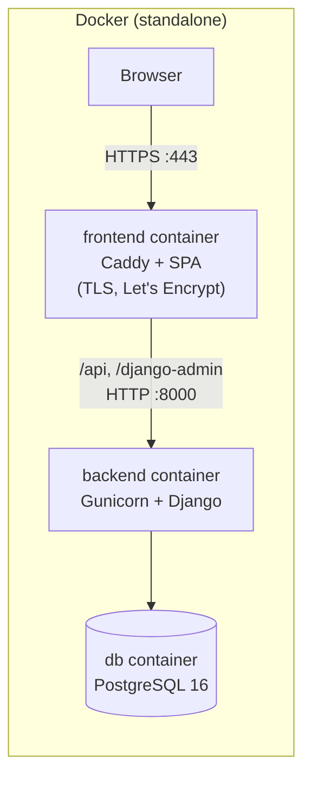
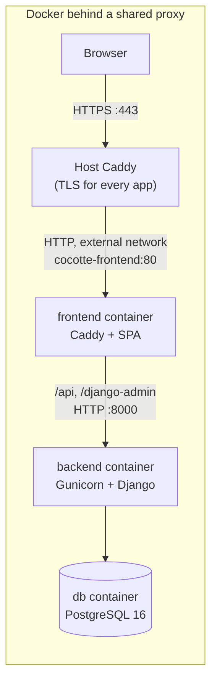

# Production deployment

This page explains how to put Cocotte in production on your own server, from an empty machine to a
working HTTPS site with an administrator account and reference data.

There are three supported ways to run it:

| Variant | When to use it | What handles HTTPS |
|---|---|---|
| **Docker** (standalone, the default) | Cocotte is the only web application on the server. | The bundled Caddy inside the `frontend` container, with automatic Let's Encrypt certificates. |
| **Docker behind a shared proxy** | The server already runs a host-level Caddy shared by several applications. | The host Caddy. Cocotte's own Caddy only speaks plain HTTP on an internal Docker network. |
| **Classic** (no Docker) | You prefer system packages and services (PostgreSQL, systemd, a host web server). | Your web server (Caddy, or nginx with Certbot). |

> [!TIP]
> If you only want to try Cocotte on your own computer, you don't need any of this: see
> [Installation](../getting-started/installation.md) instead.

## How requests flow

Whatever the variant, the browser only talks to one web server. That server serves the built Vue
application (a single-page app), serves static and uploaded files directly, and forwards API and
Django admin requests to Gunicorn, which runs the Django backend.

| Path | Served by |
|---|---|
| `/api/*` | Django backend (Gunicorn) |
| `/django-admin/*` | Django backend (Gunicorn) |
| `/static/*` | Files collected by `collectstatic` (Django admin CSS/JS) |
| `/media/*` | Uploaded files (recipe images, thematic page images) |
| everything else | The built SPA; unknown paths fall back to `index.html` |





## Prerequisites

All variants need:

- A Linux server with a public IP address.
- A domain name (for example `cocotte.example.org`) whose DNS `A` (and `AAAA` if you use IPv6)
  record points at the server. Create it **before** the first start: Let's Encrypt can only issue
  a certificate once the name resolves to your server.
- Ports **80** and **443** open in the firewall. Port 80 is needed for the Let's Encrypt HTTP
  challenge and for the HTTP → HTTPS redirect.
- Outgoing HTTPS access from the server: recipe import from a URL, the **Suggest a free image**
  button of the recipe form ([Openverse](https://openverse.org/)), and the **Suggest values**
  button of the ingredient form (Open Food Facts and Agribalyse), call external websites.
- An SMTP account to send password-reset emails (see [Configuration](configuration.md#email-smtp)).

Per variant:

| Variant | Additional requirements |
|---|---|
| Docker | Docker Engine and the Docker Compose plugin (`docker compose`), Git. |
| Docker behind a shared proxy | The same, plus an existing Caddy stack on the host and an external Docker network it is attached to. |
| Classic | PostgreSQL (the Docker variant uses version 16), Python 3.11 or later, [uv](https://docs.astral.sh/uv/), Node.js (the Docker build uses Node 22) and npm, the WeasyPrint system libraries, Caddy or nginx, systemd. |

## Install Cocotte

The procedure differs per variant. Pick the tab that matches your setup; the following sections
([first administrator and reference data](#create-the-first-administrator-and-load-reference-data),
[post-install checklist](#post-install-checklist)) apply to all of them.

/// tab | Docker

This is the default mode of `docker-compose.prod.yml`. It starts three containers:

- `db`: PostgreSQL 16 (`postgres:16-alpine`), database `cocotte`, user `postgres`.
- `backend`: the Django API served by Gunicorn (3 workers), built from `backend/Dockerfile`
  (`prod` target).
- `frontend`: Caddy serving the built SPA, reverse-proxying `/api` and `/django-admin` to
  `backend`, serving `/static` and `/media` from shared volumes, and terminating TLS. It
  publishes ports `80` and `443` and obtains and renews its own Let's Encrypt certificate for
  `DOMAIN`.

1. Clone the repository on the server, for example in `/opt/cocotte`:

    ```bash
    git clone https://github.com/jacquesfize/cocotteapp.git /opt/cocotte
    cd /opt/cocotte
    ```

2. Create the production environment file from the template:

    ```bash
    cp .env.prod.example .env.prod
    chmod 600 .env.prod
    ```

3. Edit `.env.prod`. At minimum set:

    | Variable | Example |
    |---|---|
    | `DOMAIN` | `cocotte.example.org` |
    | `ACME_EMAIL` | `admin@example.org` |
    | `DJANGO_SECRET_KEY` | a long random value (see [Generate a secret key](configuration.md#generate-a-secret-key)) |
    | `DJANGO_ALLOWED_HOSTS` | `cocotte.example.org` |
    | `CORS_ALLOWED_ORIGINS` | `https://cocotte.example.org` |
    | `CSRF_TRUSTED_ORIGINS` | `https://cocotte.example.org` |
    | `POSTGRES_PASSWORD` | a strong password |
    | `DATABASE_URL` | `postgres://postgres:<same password>@db:5432/cocotte` |
    | `FRONTEND_URL` | `https://cocotte.example.org` |
    | `EMAIL_*`, `DEFAULT_FROM_EMAIL` | your SMTP settings |

    Every variable is described in [Configuration](configuration.md).

4. Build and start the stack:

    ```bash
    docker compose -f docker-compose.prod.yml --env-file .env.prod up --build -d
    ```

5. Follow the logs until Caddy reports that it obtained the certificate and Gunicorn is listening:

    ```bash
    docker compose -f docker-compose.prod.yml --env-file .env.prod logs -f
    ```

The certificate is stored in the `caddy_data` volume, so it survives restarts and rebuilds.

> [!IMPORTANT]
> `POSTGRES_PASSWORD` is only applied when the `db` container initialises an **empty** data
> volume. The password embedded in `DATABASE_URL` must be identical to it. Changing
> `POSTGRES_PASSWORD` later does not change the password of the existing database.

> [!WARNING]
> `.env.prod` is not listed in `.gitignore`. Never commit it: it contains your secret key and
> passwords.

///

/// tab | Docker behind a shared proxy

Use this mode when a single Caddy instance, running in its own stack on the host, owns ports 80
and 443 and handles HTTPS for every application on the server. The
`docker-compose.prod.proxy.yml` overlay changes the `frontend` service so that it:

- no longer publishes any port;
- mounts `deploy/Caddyfile.proxy` (plain HTTP on `:80`, no TLS) instead of
  `deploy/Caddyfile.standalone`;
- joins an external Docker network, named by `PROXY_NETWORK_NAME` (default `proxy`), on which the
  host Caddy reaches it as `cocotte-frontend`.

Because TLS is terminated by the host Caddy, `deploy/Caddyfile.proxy` always forwards
`X-Forwarded-Proto: https` to Django. Without it, Django's HTTPS redirect would answer every
request with a redirect loop.

1. Create the shared network, once per server (skip this if your host Caddy already uses one):

    ```bash
    docker network create proxy
    ```

    Make sure the host Caddy container is attached to this network.

2. Add a site block for Cocotte to the host Caddy's `Caddyfile` (for example
   `/opt/docker/caddy/Caddyfile`):

    ```caddyfile
    cocotte.example.org {
        reverse_proxy cocotte-frontend:80
    }
    ```

    Then reload the host Caddy, from the host Caddy stack's directory:

    ```bash
    docker compose exec caddy caddy reload --config /etc/caddy/Caddyfile
    ```

    The service name (`caddy`) and the Caddyfile path depend on how your host Caddy stack is set
    up.

3. Clone Cocotte in its own directory, for example `/opt/docker/cocotte`, and create the
   environment file:

    ```bash
    git clone https://github.com/jacquesfize/cocotteapp.git /opt/docker/cocotte
    cd /opt/docker/cocotte
    cp .env.prod.example .env.prod
    chmod 600 .env.prod
    ```

4. Edit `.env.prod` as in the `Docker` tab, with these differences:

    - Set `PROXY_NETWORK_NAME` to the name of the network from step 1 (default `proxy`).
    - `DOMAIN` and `ACME_EMAIL` are unused: the host Caddyfile declares the domain and manages the
      certificate.
    - `DJANGO_ALLOWED_HOSTS`, `CORS_ALLOWED_ORIGINS`, `CSRF_TRUSTED_ORIGINS` and `FRONTEND_URL`
      must still match the public domain declared in the host Caddyfile.

5. Build and start the stack with both compose files:

    ```bash
    docker compose -f docker-compose.prod.yml -f docker-compose.prod.proxy.yml --env-file .env.prod up --build -d
    ```

> [!IMPORTANT]
> In this mode, every `docker compose` command shown in this guide must include
> `-f docker-compose.prod.proxy.yml` after `-f docker-compose.prod.yml`. Otherwise Compose
> would recreate `frontend` in standalone mode and try to publish ports 80 and 443.

> [!NOTE]
> The `frontend` container has a fixed name, `cocotte-frontend`. You can therefore run only one
> Cocotte stack per Docker host without editing the compose file.

///

/// tab | Classic

This variant runs the same components without Docker: PostgreSQL from your distribution, the
Django backend under Gunicorn managed by systemd, and the built SPA served by a web server that
also reverse-proxies the backend. The commands below target Debian/Ubuntu and assume the code
lives in `/opt/cocotte` and runs as a dedicated `cocotte` system user; adapt paths and package
names to your system.

**1. Install system packages**

```bash
sudo apt update
sudo apt install -y git postgresql \
    libpango-1.0-0 libpangoft2-1.0-0 libharfbuzz0b libfontconfig1 libglib2.0-0 \
    shared-mime-info fonts-liberation
```

The second line is the set of libraries WeasyPrint needs to render the recipe and week PDFs. It
is the same list as in `backend/Dockerfile`, which additionally installs `libpq-dev` and `gcc`;
those are only needed if the PostgreSQL driver has to be compiled, which the `psycopg[binary]`
dependency normally avoids.

Also install:

- [uv](https://docs.astral.sh/uv/getting-started/installation/), installed somewhere on every
  user's `PATH` (for example `/usr/local/bin`) so that the `cocotte` user can run it. uv
  downloads Python 3.11+ itself if your system Python is older;
- Node.js 22 and npm (for example from NodeSource or your distribution);
- your web server: [Caddy](https://caddyserver.com/docs/install) (recommended, automatic HTTPS)
  or nginx with Certbot.

**2. Create the database**

```bash
sudo -u postgres createuser --pwprompt cocotte
sudo -u postgres createdb --owner cocotte cocotte
```

The first migration enables the `unaccent` and `pg_trgm` PostgreSQL extensions (used for accent-
and typo-tolerant ingredient search). Making the `cocotte` role the **owner** of the database is
what allows it to create them (both are "trusted" extensions since PostgreSQL 13). On an older
PostgreSQL, create them once as a superuser:

```bash
sudo -u postgres psql cocotte -c 'CREATE EXTENSION IF NOT EXISTS unaccent; CREATE EXTENSION IF NOT EXISTS pg_trgm;'
```

**3. Get the code and install the backend**

```bash
sudo useradd --system --create-home --home-dir /opt/cocotte --shell /usr/sbin/nologin cocotte
sudo -u cocotte git clone https://github.com/jacquesfize/cocotteapp.git /opt/cocotte/app
```

In the rest of this tab, `/opt/cocotte/app` is the repository root. Install the Python
dependencies without the development group and with the `prod` extra (which adds Gunicorn),
exactly like the production Docker image does:

```bash
cd /opt/cocotte/app/backend
sudo -u cocotte uv sync --frozen --no-group dev --extra prod
```

This creates the virtual environment in `backend/.venv`.

**4. Configure the backend**

Django reads `backend/.env` automatically. Create it from the development template and edit it:

```bash
cd /opt/cocotte/app/backend
sudo -u cocotte cp .env.example .env
sudo chmod 600 .env
```

Set at least the following (see [Configuration](configuration.md) for every variable):

```ini
DJANGO_SECRET_KEY=<long random value>
DJANGO_ALLOWED_HOSTS=cocotte.example.org
CORS_ALLOWED_ORIGINS=https://cocotte.example.org
CSRF_TRUSTED_ORIGINS=https://cocotte.example.org
DATABASE_URL=postgres://cocotte:<password>@localhost:5432/cocotte
EMAIL_BACKEND=django.core.mail.backends.smtp.EmailBackend
EMAIL_HOST=smtp.example.org
EMAIL_PORT=587
EMAIL_HOST_USER=<user>
EMAIL_HOST_PASSWORD=<password>
EMAIL_USE_TLS=True
DEFAULT_FROM_EMAIL=Cocotte <noreply@cocotte.example.org>
FRONTEND_URL=https://cocotte.example.org
```

Remove the `DEBUG=True` line copied from the template (it is ignored by the production settings
anyway, but it is misleading).

> [!IMPORTANT]
> `DJANGO_SETTINGS_MODULE` cannot go in `backend/.env`: the settings module is chosen before that
> file is read. `manage.py` defaults to the **development** settings (`config.settings.dev`,
> `DEBUG=True`), while Gunicorn's `config.wsgi` defaults to `config.settings.prod`. Always pass
> it to management commands in production. This guide runs them as the `cocotte` user (who owns
> `backend/.env`, readable by nobody else) with:
>
> ```bash
> sudo -u cocotte env DJANGO_SETTINGS_MODULE=config.settings.prod .venv/bin/python manage.py <command>
> ```

**5. Initialise the database and static files**

These are the two commands the Docker image's entrypoint runs automatically:

```bash
cd /opt/cocotte/app/backend
sudo -u cocotte env DJANGO_SETTINGS_MODULE=config.settings.prod .venv/bin/python manage.py migrate --noinput
sudo -u cocotte env DJANGO_SETTINGS_MODULE=config.settings.prod .venv/bin/python manage.py collectstatic --noinput
```

`collectstatic` writes to `backend/staticfiles/`; uploaded files go to `backend/media/`.

> [!NOTE]
> Production commands in this guide call the virtual environment's interpreter
> (`.venv/bin/python`) directly. `uv run` also works, but it re-syncs the environment with the
> default dependency groups, which re-installs the development tools on the server.

**6. Run Gunicorn with systemd**

Create `/etc/systemd/system/cocotte.service`. The command mirrors the one in
`backend/Dockerfile`, but binds to the loopback interface only:

```ini
[Unit]
Description=Cocotte backend (Gunicorn)
After=network.target postgresql.service
Requires=postgresql.service

[Service]
User=cocotte
Group=cocotte
WorkingDirectory=/opt/cocotte/app/backend
Environment=DJANGO_SETTINGS_MODULE=config.settings.prod
ExecStart=/opt/cocotte/app/backend/.venv/bin/gunicorn config.wsgi:application \
    --bind 127.0.0.1:8000 --workers 3 --access-logfile - --error-logfile -
Restart=on-failure

[Install]
WantedBy=multi-user.target
```

Then enable and start it:

```bash
sudo systemctl daemon-reload
sudo systemctl enable --now cocotte
sudo systemctl status cocotte
```

**7. Build the frontend**

```bash
cd /opt/cocotte/app/frontend
sudo -u cocotte npm ci
sudo -u cocotte npm run build
```

The build output (including the PWA service worker) is written to `frontend/dist/`. The frontend
calls the API on the same origin (`/api/`), so there is nothing to configure at build time.

**8. Configure the web server**

The web server must reproduce `deploy/Caddyfile.standalone`: serve `/static/` and `/media/` from
disk, send `/api/` and `/django-admin/` to Gunicorn, and serve the SPA with a fallback to
`index.html` for every other path. The web server user needs read access to `frontend/dist`,
`backend/staticfiles` and `backend/media`.

With **Caddy** (automatic HTTPS), `/etc/caddy/Caddyfile`:

```caddyfile
{
	email admin@example.org
}

cocotte.example.org {
	encode gzip

	handle_path /static/* {
		root * /opt/cocotte/app/backend/staticfiles
		file_server
	}

	handle_path /media/* {
		root * /opt/cocotte/app/backend/media
		file_server
	}

	@backend path /api/* /django-admin /django-admin/*
	handle @backend {
		reverse_proxy 127.0.0.1:8000
	}

	handle {
		root * /opt/cocotte/app/frontend/dist
		try_files {path} /index.html
		file_server
	}
}
```

```bash
sudo systemctl reload caddy
```

Caddy sets the `X-Forwarded-Proto` header that Django relies on to know the request arrived over
HTTPS.

With **nginx**, obtain a certificate with Certbot (`sudo certbot certonly --nginx -d
cocotte.example.org`, or your usual method), then create
`/etc/nginx/sites-available/cocotte` and enable it:

```nginx
server {
    listen 80;
    listen [::]:80;
    server_name cocotte.example.org;
    return 301 https://$host$request_uri;
}

server {
    listen 443 ssl http2;
    listen [::]:443 ssl http2;
    server_name cocotte.example.org;

    ssl_certificate     /etc/letsencrypt/live/cocotte.example.org/fullchain.pem;
    ssl_certificate_key /etc/letsencrypt/live/cocotte.example.org/privkey.pem;

    # nginx refuses request bodies over 1 MB by default: raise it for image uploads
    # and recipe archive imports.
    client_max_body_size 50m;

    gzip on;
    gzip_types text/css application/javascript application/json image/svg+xml;

    root /opt/cocotte/app/frontend/dist;

    location /static/ {
        alias /opt/cocotte/app/backend/staticfiles/;
    }

    location /media/ {
        alias /opt/cocotte/app/backend/media/;
    }

    location ~ ^/(api/|django-admin(/|$)) {
        proxy_pass http://127.0.0.1:8000;
        proxy_set_header Host $host;
        proxy_set_header X-Forwarded-Proto $scheme;
        proxy_set_header X-Forwarded-For $proxy_add_x_forwarded_for;
        proxy_read_timeout 120s;
    }

    location / {
        try_files $uri $uri/ /index.html;
    }
}
```

```bash
sudo ln -s /etc/nginx/sites-available/cocotte /etc/nginx/sites-enabled/cocotte
sudo nginx -t && sudo systemctl reload nginx
```

> [!IMPORTANT]
> Whatever the web server, it must forward the original `Host` header and set
> `X-Forwarded-Proto: https`. Without `X-Forwarded-Proto`, Django (which redirects HTTP to HTTPS
> in production) redirects every API request in a loop.

///

## Create the first administrator and load reference data

The Docker image runs `migrate` and `collectstatic` automatically every time the `backend`
container starts with Gunicorn (see `backend/docker-entrypoint.sh`); in the Classic variant you
ran them in step 5. What remains, for every variant, is creating an administrator account and
loading the reference data.

The database starts empty. The seed data is what makes nutrition alerts, carbon footprints,
allergens and the homepage shortcuts work, so load it before opening the site to users.

1. Create a superuser. You are asked for an email address (used to log in), a username (the name
   displayed in the app) and a password.

    /// tab | Docker

    ```bash
    docker compose -f docker-compose.prod.yml --env-file .env.prod exec backend python manage.py createsuperuser
    ```

    ///

    /// tab | Docker behind a shared proxy

    ```bash
    docker compose -f docker-compose.prod.yml -f docker-compose.prod.proxy.yml --env-file .env.prod exec backend python manage.py createsuperuser
    ```

    ///

    /// tab | Classic

    ```bash
    cd /opt/cocotte/app/backend
    sudo -u cocotte env DJANGO_SETTINGS_MODULE=config.settings.prod .venv/bin/python manage.py createsuperuser
    ```

    ///

    See [Users](users.md#create-the-first-superuser) for a non-interactive variant.

2. Load the reference data, in this order:

    /// tab | Docker

    ```bash
    docker compose -f docker-compose.prod.yml --env-file .env.prod exec backend python manage.py seed_allergens
    docker compose -f docker-compose.prod.yml --env-file .env.prod exec backend python manage.py seed_common_ingredients
    docker compose -f docker-compose.prod.yml --env-file .env.prod exec backend python manage.py seed_cookware
    docker compose -f docker-compose.prod.yml --env-file .env.prod exec backend python manage.py seed_nutrient_requirements
    docker compose -f docker-compose.prod.yml --env-file .env.prod exec backend python manage.py seed_thematic_pages
    ```

    ///

    /// tab | Docker behind a shared proxy

    ```bash
    docker compose -f docker-compose.prod.yml -f docker-compose.prod.proxy.yml --env-file .env.prod exec backend python manage.py seed_allergens
    docker compose -f docker-compose.prod.yml -f docker-compose.prod.proxy.yml --env-file .env.prod exec backend python manage.py seed_common_ingredients
    docker compose -f docker-compose.prod.yml -f docker-compose.prod.proxy.yml --env-file .env.prod exec backend python manage.py seed_cookware
    docker compose -f docker-compose.prod.yml -f docker-compose.prod.proxy.yml --env-file .env.prod exec backend python manage.py seed_nutrient_requirements
    docker compose -f docker-compose.prod.yml -f docker-compose.prod.proxy.yml --env-file .env.prod exec backend python manage.py seed_thematic_pages
    ```

    ///

    /// tab | Classic

    ```bash
    cd /opt/cocotte/app/backend
    sudo -u cocotte env DJANGO_SETTINGS_MODULE=config.settings.prod .venv/bin/python manage.py seed_allergens
    sudo -u cocotte env DJANGO_SETTINGS_MODULE=config.settings.prod .venv/bin/python manage.py seed_common_ingredients
    sudo -u cocotte env DJANGO_SETTINGS_MODULE=config.settings.prod .venv/bin/python manage.py seed_cookware
    sudo -u cocotte env DJANGO_SETTINGS_MODULE=config.settings.prod .venv/bin/python manage.py seed_nutrient_requirements
    sudo -u cocotte env DJANGO_SETTINGS_MODULE=config.settings.prod .venv/bin/python manage.py seed_thematic_pages
    ```

    ///

| Command | What it loads |
|---|---|
| `seed_allergens` | The reference allergen list (the 14 EU allergens plus lactose), used by user profiles and the ingredient form. |
| `seed_common_ingredients` | About 170 common ingredients with nutrition values, carbon footprint, seasonality, English/German/Spanish names and reviewed allergens. It also runs `seed_allergens` itself, so the allergen list is guaranteed even if you skipped the first command. |
| `seed_cookware` | About 60 common cookware items (oven, air fryer, pans, dishes, tools) with their English names, emojis and photos downloaded from Wikimedia Commons (needs Internet access; `--skip-images` to skip them), offered in the recipe form and the **Cookware** filter. |
| `seed_nutrient_requirements` | Daily minimum intakes (protein, iron, vitamin B12, calcium, omega-3, zinc) for each diet type and activity level. Without them, the planner shows no deficiency alerts. |
| `seed_thematic_pages` | Three homepage shortcuts: seasonal produce, vegan, and ready in 30 minutes, with their images. |

Besides seeding, two commands should run on a schedule: `purge_inactive_users` (see
[GDPR compliance](gdpr.md#inactive-accounts)) and `purge_audit_logs` (see
[Moderation log](gdpr.md#moderation-log)).

All seed commands are idempotent: running them again never creates duplicates. They do, however,
reset the records they manage to their seeded values; see
[Re-run the seed commands](maintenance.md#re-run-the-seed-commands) before re-running them on a
live site.

## Post-install checklist

Work through this list once the stack is up.

1. **HTTPS works.** Open `https://cocotte.example.org/` in a browser: the certificate must be
   valid, and `http://` must redirect to `https://`.
2. **The API answers.** The health endpoint returns `{"status": "ok"}`:

    ```bash
    curl https://cocotte.example.org/api/health/
    ```

3. **Django admin loads with its styles.** Open `https://cocotte.example.org/django-admin/` and
   log in with the superuser's email and password. Missing styles mean `/static/` is not served
   (check `collectstatic` and the web server configuration).
4. **Staff pages are visible.** Log in to the app with the same account: the account menu shows an
   **Administration** section with **Admin**, **Thematic pages** and **Ingredients**.
5. **Reference data is loaded.** **Ingredients** lists the seeded ingredients, and the homepage
   shows the thematic shortcuts under **Explore**.
6. **Emails are sent.** Log out, click **Forgot your password?** on the login page, and request
   a reset for your address. The email must arrive, and its link must start with your public URL
   (it is built from `FRONTEND_URL`). If nothing arrives, check the backend logs (see
   [Maintenance](maintenance.md#read-the-logs)): with the default console backend, the email is
   only printed there.
7. **PDF export works.** Open a recipe and click **Download as PDF**. A failure here usually means
   missing WeasyPrint libraries (Classic variant).
8. **Backups are scheduled.** See [Back up and restore](maintenance.md#back-up-and-restore).

> [!NOTE]
> In the Docker variants, `docker compose ps` may report the `backend` container as
> `unhealthy`. Its built-in healthcheck calls `http://localhost:8000/api/health/` from inside the
> container, which the production settings reject (`localhost` is not in `DJANGO_ALLOWED_HOSTS`,
> and plain-HTTP requests are redirected to HTTPS). Nothing depends on this status; check health
> through the public URL as shown above.

## Next steps

- Review every setting in [Configuration](configuration.md).
- Plan updates and backups with [Maintenance](maintenance.md).
- Manage accounts in [Users](users.md) and curate the [Ingredient library](ingredients.md).
