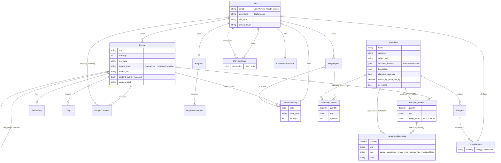
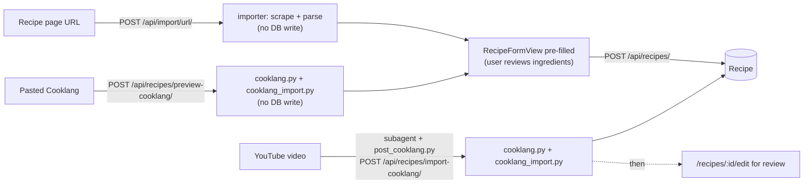
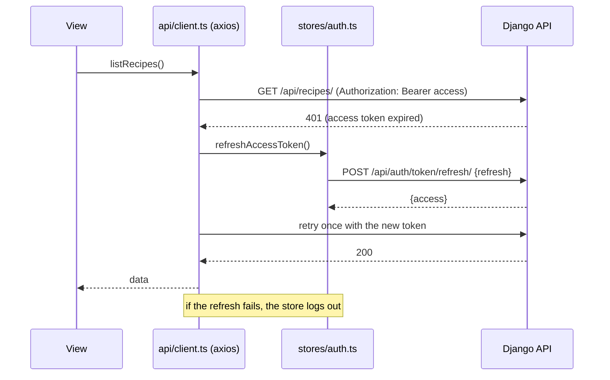
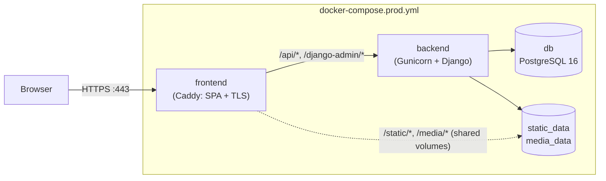

# Architecture

Cocotte is a single-page application (Vue 3 + TypeScript) talking to a JSON API (Django 5 +
Django REST Framework) backed by PostgreSQL. This page explains how the pieces fit together, so
you know where a change belongs before you start writing it.

## Repository layout

```text
cocotteapp/
├── backend/                     Django project (managed with uv)
│   ├── config/
│   │   ├── settings/            base.py, dev.py, prod.py
│   │   └── urls.py              mounts every app under /api/, plus JWT and /django-admin/
│   ├── apps/                    one Django app per domain (see below)
│   ├── Dockerfile               multi-stage: "dev" (runserver) and "prod" (Gunicorn)
│   ├── docker-entrypoint.sh     migrate + collectstatic before Gunicorn starts
│   └── pyproject.toml, uv.lock  dependencies, pytest and ruff configuration
├── frontend/                    Vue 3 + Vite + TypeScript SPA
│   ├── src/
│   │   ├── api/                 one module per backend resource, on a shared axios client
│   │   ├── views/               route-level components (fetch their own data)
│   │   ├── components/          reusable components
│   │   ├── stores/auth.ts       the only Pinia store
│   │   ├── router/index.ts      routes and the global auth guard
│   │   ├── i18n/                vue-i18n setup and fr/en locale files
│   │   ├── offline/             IndexedDB write queue for offline shopping-list check-off
│   │   ├── types/               TypeScript types mirroring the DRF serializers
│   │   └── utils/               Cooklang mention/timer parsing, formatting, theme, ...
│   ├── tests/unit/              Vitest
│   ├── tests/e2e/               Playwright (against a real backend)
│   ├── tests/docs/              Playwright scenarios generating documentation screenshots
│   ├── vite.config.ts           dev proxy + PWA/Workbox configuration
│   └── Dockerfile               multi-stage: "dev" (Vite) and "prod" (Caddy serving dist/)
├── deploy/                      Caddyfile.standalone and Caddyfile.proxy (production)
├── docker-compose.yml           development stack
├── docker-compose.prod.yml      production stack (standalone, automatic HTTPS)
├── docker-compose.prod.proxy.yml  overlay: run behind a shared host-level Caddy
├── scripts/youtube_recipes/     helper scripts for the YouTube importer subagent
├── .claude/agents/              Claude Code subagents (YouTube recipe importer)
├── docs/, mkdocs.yml            this documentation site
└── .github/workflows/           ci.yml (tests) and docs.yml (documentation site)
```

## Backend

### One app per domain

Every domain lives in its own Django app under `backend/apps/`, with a consistent internal shape:
`models.py`, `serializers.py`, `views.py`, `urls.py`, `filters.py`, `factories.py` (factory-boy
test factories) and `tests/`. Business logic that belongs neither on a model nor in a
view/serializer lives in the app's `services.py`, or in a dedicated module for larger features.

| App | Responsibility | Notable modules |
|---|---|---|
| `accounts` | Custom `User` (login by email), allergy/intolerance profile, registration, `/auth/me/` (profile, password change, data export, account deletion), password reset by email, staff user administration | `admin_urls.py` (mounted at `/api/admin/`) |
| `ingredients` | `Ingredient` library (nutrition per 100 g, carbon footprint, seasonality, translations, allergens) and the `Allergen` reference table | `search.py` (fuzzy `unaccent` + trigram search), `services.py` (Open Food Facts / Agribalyse suggestions), `allergen_tags.py`, `templatetags/unit_labels.py`, seed commands |
| `recipes` | `Recipe`, ingredients, steps, tags, versions (forks), comments, thematic pages, PDF export, ZIP export/import, Cooklang import | `cooklang.py`, `cooklang_import.py`, `transfer.py`, `permissions.py`, `throttles.py`, `youtube.py` |
| `nutrition` | `NutrientRequirement` thresholds; nutrition and carbon computations | `services.py` (`compute_recipe_nutrition`, `compute_recipe_carbon_footprint`, `find_deficiencies`) |
| `planning` | `MealPlanEntry`, planner sharing, weekly nutrition summary, week PDF, calendar export | `ics.py` (iCalendar), `CalendarFeedToken` |
| `shopping` | `ShoppingList` generated from planner entries | `services.py` (aggregation, owned items, text export) |
| `importer` | Recipe import from a URL (preview only, nothing written) | `services.py` (scraping, free image search via Openverse), `ingredient_parsing.py` |
| `blog` | `BlogPost` (HTML content written in a WYSIWYG editor), its comments, images uploaded from the editor | `sanitize.py` (server-side HTML allow-list, see [Blog posts](#blog-posts)) |

All app URLs are mounted under `/api/` in `config/urls.py`. JWT endpoints
(`/api/auth/token/`, `/api/auth/token/refresh/`) are wired directly there with SimpleJWT views,
not through `apps.accounts.urls`. The health check `/api/health/` is defined inline too.

### Data model

The diagram shows the key models and their relations (field lists trimmed to the essentials).



Two models stand on their own, with no foreign keys:

- `NutrientRequirement` (`nutrition`): a daily minimum per `(diet_type, activity_level,
  nutrient)`, compared against the user's profile to raise deficiency alerts.
- `ThematicPage` (`recipes`): a title, icon, image and a `filters` JSON object holding the same
  query parameters `/api/recipes/` accepts (e.g. `{"diet_type": "vegan"}`); the home page links to
  the recipe list with those filters applied.

A few rules worth knowing:

- `User` extends `AbstractUser` with `USERNAME_FIELD = "email"`: people log in with their email;
  `username` is still required at registration but only used as a public display name.
- Deleting a user cascades to their recipes, planner, shopping lists and shares. Ingredients are
  `PROTECT`ed: an ingredient used by a recipe or a shopping list cannot be deleted (the API
  returns `409`).
- `Ingredient` and `Cookware` are shared libraries with the same review rules: a non-staff
  `POST` records `created_by` and sets `is_verified = False` (only staff can write
  `is_verified`). `can_be_edited_by(user)` on each model (backed by
  `ingredients.models.can_edit_library_item`) is the single rule for update/delete: staff
  always; otherwise only the creator of an unverified item that no other user's data uses
  (`is_used_by_others`: recipes and shopping lists for ingredients, recipes for cookware). The
  viewsets enforce it with `ingredients.permissions.CanEditLibraryItem`, expose it as `can_edit`
  and precompute `used_by_others` with `Exists` subqueries on list endpoints. Both accept
  `?is_verified=true|false`, and staff can `POST /api/{ingredients,cookware}/{id}/merge/` with
  `{"into": <id>}` (`merge_ingredients` in `ingredients/services.py`, `merge_cookware` in
  `recipes/services.py`) to fold a duplicate into another item.
- Recipe allergens are **derived** from their ingredients (`Recipe.allergen_slugs()`). An
  ingredient with `allergens_reviewed = False` makes the recipe "unverified" rather than safe.
- `Recipe.is_content_restricted(user)` is the single source of truth for copyright protection:
  a recipe with a `source_url` and without `content_publicly_licensed` hides its `description`
  and `steps` (`RecipeSerializer.RESTRICTED_HIDDEN_FIELDS`) from anyone but its owner and staff.
  Ingredients and times stay public: they are facts, not covered by copyright. The serializer,
  the `fork` action and the PDF export all go through it. The recipe form only lets the owner
  tick `content_publicly_licensed` on an imported draft once no step is still the scraped text.
- `GET /api/import/image-suggestions/?q=` (`importer.services.search_free_images`) proxies
  [Openverse](https://openverse.org/)'s public API (no key) and returns only CC BY, CC BY-SA, CC0
  and public-domain pictures, already mapped to the recipe's `image_license`/`image_credit_*`
  fields.
- Versions: a fork's `root_recipe` always points at the family's root (never at an intermediate
  fork), so `family_versions()` is a single query.

### Business logic

- **Nutrition** (`nutrition/services.py`): ingredient values are per 100 g/100 ml; quantities are
  converted to grams with an approximate table (`piece` = 100 g, `tbsp` = 15 g, ...), summed per
  recipe, then divided by servings. The weekly summary averages the displayed week per day and
  compares it with the `NutrientRequirement` rows for the user's diet and activity level.
- **Carbon footprint**: the same conversion multiplied by `carbon_kg_co2e_per_kg`, exposed per
  recipe (`/api/recipes/{id}/nutrition/`) and summed for the week.
- **Shopping lists** (`shopping/services.py`): each entry's ingredients are scaled by
  `entry.servings / recipe.servings`, aggregated per `(ingredient, unit)`, and integer-only units
  (`piece`, `pinch`) are rounded up.
- **Permissions**: `IsAuthorOrReadOnly` (author or staff may write a recipe),
  `IsRecipeAuthorOrStaff` (comment moderation), DRF's `IsAdminUser` for everything under
  `/api/admin/` and for ingredient/cookware merge, `CanEditLibraryItem` for ingredient/cookware
  update/delete (see above). Anonymous comment creation is throttled
  (`comment_create`, 10/hour).
- **Planner sharing**: `MealPlanEntryViewSet` accepts an `?owner=` parameter resolved through a
  single helper that checks the `PlanningShare` permission; entries created through a write
  share belong to the planner's owner.

### Blog posts

A post's `content` is HTML produced by the frontend editor
([TipTap](https://tiptap.dev/), `components/blog/BlogEditor.vue`) and rendered with `v-html`
(`components/blog/BlogContent.vue`). The API is therefore the only barrier against stored XSS:
`BlogPostSerializer.validate_content` runs it through `apps/blog/sanitize.py`
([nh3](https://nh3.readthedocs.io/)), a tag/attribute allow-list where `` must be
`http(s)://` or `/media/…` and the only `<iframe>` kept is a recipe embed whose `src` is exactly
`/embed/recipes/<id>`. Extend the allow-list there, and in the editor's extensions, together.

A recipe embed is a custom TipTap node (`components/blog/recipeEmbed.ts`, an atom block node
with an `insertRecipeEmbed` command and the `Mod-Alt-r` shortcut) serialised as
`<iframe data-cocotte-recipe="<id>" src="/embed/recipes/<id>">`. That route renders
`views/embed/RecipeEmbedView.vue` with `meta.embed` (no navbar or footer, see `App.vue`); the
view posts its height to the parent window (`utils/embedMessages.ts`), and
`composables/useEmbedAutoHeight.ts` resizes the matching iframe, same origin only.

The list (`views/blog/BlogListView.vue`) follows the recipe list pattern: `search`/`author`/
`page` synced with the URL query string, and a `components/blog/BlogFilters.vue` panel that
mirrors `RecipeFilters.vue`, fed by `GET /api/blog/posts/authors/` (users with at least one post).
`?search=` matches the title, the HTML content and the author's username.
The optional `cover_image` is a model field set with a separate multipart
`PATCH`/`DELETE /api/blog/posts/{id}/cover/` (the form uploads it after saving the post); in the
list, `cover_image` falls back to the first `` of the content.

Comments reuse the recipe comment rules (anonymous posting, `comment_create` throttle, hiding by
the post's author or staff) and the same `components/shared/CommentThread.vue`, which takes the
list/create/hide API calls as props.

### Recipe import paths

There are three independent ways to create a recipe from outside content:



1. **URL import** (`apps.importer`): `POST /api/import/url/` scrapes the page synchronously with
   [`recipe-scrapers`](https://github.com/hhursev/recipe-scrapers), deliberately leaves out the
   source's picture (its photographer's copyright), parses each ingredient line (`ingredient_parsing.py`) and matches it
   against the library, including `Ingredient.translations` so an English recipe maps onto French
   ingredients. It returns a **preview only**: the frontend stores it in memory
   (`utils/pendingImportDraft.ts`) and opens the recipe form, where the user fixes unmatched
   ingredients before saving with a normal `POST /api/recipes/`.
2. **Cooklang paste**: the recipe form's "Cooklang" mode (creation only) posts raw markup to
   `POST /api/recipes/preview-cooklang/` (`build_cooklang_preview`), which returns a **preview
   only**, in the same shape as the URL import's plus `description`, `prep_time_minutes` and each
   ingredient's `group_name`. Unmatched ingredients come back with `ingredient: null` instead of
   being created, and a missing title is allowed (the form requires one). `RecipeFormView`
   fills the manual form with it (`applyImportDraft`, shared with the URL import) and the user
   saves with a normal `POST /api/recipes/` carrying `source_type = cooklang`; `raw_cooklang` is
   not kept on this path.
3. **YouTube**: the Claude Code subagent (`.claude/agents/youtube-recipe-importer.md`) writes
   Cooklang from a video transcript and posts it to the same endpoint with
   `scripts/youtube_recipes/post_cooklang.py`, in one call carrying the video/source/image URLs.

### Cooklang: two parsers

Cocotte reads [Cooklang](https://cooklang.org/) markup: `@ingredient{qty%unit}(note)` (multi-word
names with braces, or joined with an underscore as in `@huile_olive{2%cs}`), `#cookware{}`, timers
`~name{10%minutes}`, sections, notes and metadata.

- **Backend** (`apps/recipes/cooklang.py`): parsing is delegated to the
  [`cooklang-py`](https://pypi.org/project/cooklang-py/) library (YAML front matter, inline
  tags, comments). `cooklang.py` adapts its output into a `ParsedRecipe`: paragraphs become steps
  (or each line, when the text has no blank line, Cocotte's historical format still written by the
  YouTube agent), `= Section` titles label the ingredients below them, `> notes` are kept apart,
  legacy `>> key: value` metadata is merged in, and step text is re-serialized in the tag syntax
  the frontend parses (`@multi_word{qty%unit}`, `~name{qty%unit}`, cookware flattened). It also
  works around a greedy `(note)` capture in the library (the note stops at the first `)`).
  `apps/recipes/cooklang_import.py` maps the result onto the data model behind
  `POST /api/recipes/import-cooklang/` (and, without writing, `preview-cooklang`): metadata to recipe fields (fields sent in the request
  win), sections to `RecipeIngredient.group_name`, notes to the description, units through
  `UNIT_ALIASES` then the URL importer's vocabulary (`apps.importer.ingredient_parsing.unit_from_word`),
  and ingredients through the URL importer's matcher (`apps.importer.services.find_matching_ingredient`:
  name, translations, close match), creating the ones that don't match (the preview leaves them
  empty). Ingredients created (or left unmatched) during an import are only merged by exact name,
  never by close match. Unparseable text, or a missing title on `import-cooklang`, raises
  `CooklangParseError`, returned as a 400.
- **Frontend** (`src/utils/cooklangMentions.ts`, `src/utils/cooklangTimers.ts`): an independent
  client-side parser for the tags stored in step text (no code is shared). Step text is
  stored as free text; the frontend parses it when editing (`CooklangStepInput.vue`:
  autocomplete on `@` over the whole ingredient library, with on-the-fly creation) and when
  displaying (`RecipeSummary.vue`: mentions become links to the ingredient list, timers become
  `StepTimerButton` countdowns).

If you change the tag syntax stored in step text, update **both** sides and their tests
(`backend/apps/recipes/tests/test_cooklang*.py`, `frontend/tests/unit/cooklang*.test.ts`).

### Ingredient sections and alternatives

- **Sections** have no table of their own: a section is the `RecipeIngredient.group_name` shared
  by its lines (`''` is the unnamed section). The same `Ingredient` can appear on several lines of
  a recipe, one per section; shopping lists, nutrition and carbon add the lines up. The recipe
  form (`components/recipes/IngredientSections.vue`) keeps a flat list of rows and keeps them
  grouped by section with `utils/ingredientSections.ts`, whose `orderRowsBySection` also gives the
  `order` sent to the API: the recipe page groups *consecutive* lines under a heading, so the
  stored order must follow the sections.
- **Step mentions** (`@butter`) match an ingredient by name only, so with several lines for the
  same ingredient they point at the first one (`buildStepSegments`), and anchors are per line
  (`ingredient-row-<index>`), never per ingredient id.
- **Alternatives** (`IngredientAlternative`, `apps/recipes/models.py`) belong to a recipe line.
  A replacement carries its own ingredient, quantity and unit; the `less` tag keeps the line's
  ingredient (`ingredient` is null), which a check constraint and
  `IngredientAlternativeSerializer.validate` both enforce. They are a table of their own, not
  extra `RecipeIngredient` rows, because nutrition, carbon and shopping sum every
  `RecipeIngredient`: alternatives are deliberately **not** counted there (a regression test
  covers it). They are written nested in `RecipeIngredientSerializer` (recreated on update),
  copied by the fork action and the archive import/export, repointed by the ingredient merge,
  and counted by `Ingredient.is_used_by_others`.
- **Swapping** is client state only (`composables/useIngredientSwaps.ts`): nothing is saved, so
  planning and shopping keep using the recipe's own lines. `RecipeSummary.vue` owns the state and
  hands it to `RecipeCookMode.vue` as a prop; both render the same pill and option list through
  `IngredientSwapControls.vue`. Cook mode also swaps the ingredient name shown in step mentions
  (via `StepSegment.ingredientIndex`) and its popover.

### PDF export

PDFs are rendered **server-side** with [WeasyPrint](https://weasyprint.org/) from Django
templates, not by a client-side library:

- `GET /api/recipes/{id}/pdf/` renders `apps/recipes/templates/pdf/recipe.html`;
- `GET /api/meal-plan-entries/week-pdf/?date_after=…&date_before=…` renders
  `apps/planning/templates/pdf/week.html` (week grid, then every recipe of the week).

Both print a heading per ingredient section (`` on `group_name`). Alternatives are
not printed.

The templates are in French and use the `unit_labels` template tags for unit labels. WeasyPrint
needs Pango/HarfBuzz/fontconfig at runtime (installed in the backend image).

### Settings

Settings are split into `config/settings/base.py` (everything), `dev.py` (`DEBUG`, CSRF trust
for the Vite proxy) and `prod.py` (HTTPS behind a proxy: `SECURE_PROXY_SSL_HEADER`, secure
cookies, HSTS, `CSRF_TRUSTED_ORIGINS`). Values come from environment variables through
`django-environ` (`backend/.env` in development); see
[Configuration](../admin-guide/configuration.md) for the full list. `DJANGO_SETTINGS_MODULE` is
`config.settings.dev` for `runserver` and pytest, and `config.settings.prod` in the production
image.

## Frontend

### Views own their data

Route-level components in `src/views/` fetch their own data in `onMounted`/`watch` by calling
functions from `src/api/*` (one module per backend resource: `recipes.ts`, `planning.ts`,
`shopping.ts`, `ingredients.ts`, ...). There is **no global store** for recipes, planning or
shopping data; the only Pinia store is `stores/auth.ts` (tokens + current user).

Lists that can grow without bound (recipes, shopping lists, admin users) share
`components/Pagination.vue` and keep their filters and page number in the URL query string, so a
filtered, paginated view is a shareable link. `RecipeListView.vue` is the reference
implementation (`filters`/`page` refs synced from `route.query`, `router.replace` after each
fetch).

The API pages at 20 items by default (`PAGE_SIZE` in `config/settings/base.py`). Recipes are the
exception: `RecipeViewSet` uses `apps/recipes/pagination.py` (10 per page, overridable with
`?page_size=` up to 50), and the list's **Recipes per page** selector offers the same choices
(`PAGE_SIZES` in `RecipeListView.vue`, kept in sync by hand with `RECIPE_PAGE_SIZES`).

### Authentication flow



- `POST /api/auth/token/` (email + password) returns an access token (1 hour) and a refresh token
  (7 days). Both are kept in `localStorage`.
- `api/client.ts` attaches `Authorization: Bearer <access>` to every request. On a `401` it asks
  the store to refresh the token and **retries the request once**; if the refresh fails, it logs
  out.
- On startup, `main.ts` calls `fetchMe()` when a token exists, so the user profile survives a
  page reload.
- Logging out also clears the private offline caches (planner, shopping lists), since the device
  may be shared.

### Routing

`src/router/index.ts` uses route-meta flags, the first two checked in a single global
`beforeEach`:

- `meta.public`: the route is reachable without being logged in (home, recipe list and detail,
  random recipe, blog list and posts, recipe embeds, login/register, password reset). Everything
  else redirects to `/login`.
- `meta.embed`: the route is meant to be shown inside an `<iframe>` (`/embed/recipes/:id`), so
  `App.vue` renders it without the navbar, offline indicator and footer.
- `meta.requiresStaff`: staff-only pages (`/admin/users`, `/admin/thematic-pages`,
  `/admin/ingredients`). This is a client-side hint only, to avoid flashing a page before
  redirecting: the API itself enforces staff-only access.
- `meta.title`: i18n key (`pageTitle.*` in the locale files) of the browser tab title, applied as
  "<page> · Cocotte" by an `afterEach` hook (`src/composables/usePageTitle.ts`, re-evaluated when
  the language changes). A view can override it once its data is loaded with
  `usePageTitle(() => recipe.value?.title)` (recipe page, blog post). Add a `meta.title` (and the
  key to both `fr.json` and `en.json`) to every new route.

Unknown URLs match the public catch-all route `/:pathMatch(.*)*` (`not-found`), which renders
`NotFoundView.vue` with links back to the home page and the recipe list instead of redirecting.

### Offline and PWA

Offline support is **deliberately narrow**:

- `vite-plugin-pwa` (configured in `vite.config.ts`, active under both `vite dev` and production
  builds) generates a Workbox service worker that caches GET responses: recipes and thematic
  pages (network-first), planner and shopping lists (network-first, per-user cache), and images
  (cache-first). PDFs and exports are never cached.
- The **only offline write** is marking a shopping-list item as owned: the UI updates
  optimistically and the write goes into an IndexedDB queue (`src/offline/db.ts`,
  `src/offline/sync.ts`) replayed on the `online` event and at startup. The Background Sync API
  isn't used because Safari/iOS doesn't support it.

> [!WARNING]
> Don't extend offline writes to other mutations without discussing it first. Offline editing of
> recipes and planning was scoped out on purpose: there is no conflict resolution.

### Internationalisation and theming

All user-facing strings go through vue-i18n (`src/i18n/`), with `fr.json` and `en.json` kept in
lockstep; see [Translations](i18n.md). Light/dark theme and the accent colour are applied by
`utils/theme.ts` through CSS variables (`[data-theme='dark']`, `--color-primary`) and remembered
in `localStorage`.

## Production topology



- **Standalone (default)**: the `frontend` container runs Caddy, which serves the built SPA
  (falling back to `index.html` for client-side routes), serves `/static` and `/media` from
  volumes shared with the backend, reverse-proxies `/api` and `/django-admin` to `backend`, and
  obtains its own Let's Encrypt certificate for `DOMAIN` (`deploy/Caddyfile.standalone`).
- **Behind a shared proxy**: the `docker-compose.prod.proxy.yml` overlay swaps in
  `deploy/Caddyfile.proxy` (plain HTTP), drops the published ports and joins an external Docker
  network where a host-level Caddy terminates TLS for every app on the server.
- The backend container runs `migrate` and `collectstatic` on start, then Gunicorn with three
  workers. There is no background worker: URL import and PDF rendering happen within the request.

See [Production deployment](../admin-guide/deployment.md) for the operational side.
