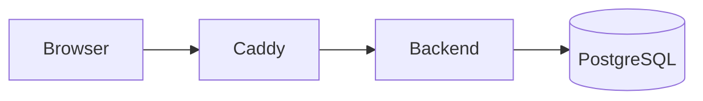

# Writing documentation

This site is built with [MkDocs](https://www.mkdocs.org/) and the
[Material for MkDocs](https://squidfunk.github.io/mkdocs-material/) theme, from the Markdown files
in `docs/`. Every page is written to read well in **two places**: the published site and GitHub's
file browser. This page explains how the documentation is organised, how to preview it, the
authoring conventions that keep both renderings working, and how screenshots are produced.

## Layout

```text
mkdocs.yml                 site configuration and navigation (nav:)
CHANGELOG.md               canonical changelog, included by docs/changelog.md
CONTRIBUTING.md            canonical contributing guide, included by docs/developer/contributing.md
docs/
├── index.md               home page
├── getting-started/       installation, first run
├── user-guide/            one page per feature area, for end users
├── admin-guide/           deployment, configuration, maintenance, staff features
├── developer/             contributor documentation (this section)
├── changelog.md           one-line include of CHANGELOG.md
├── assets/
│   ├── logo.png, favicon.svg
│   └── screenshots/       generated PNGs (Git LFS)
├── stylesheets/extra.css  brand colours
└── requirements.txt       pinned MkDocs dependencies (used locally and in CI)
```

The **navigation** is declared explicitly in the `nav:` section of `mkdocs.yml`. A new page
doesn't appear in the menu until you add it there, and `mkdocs build --strict` fails on links to
pages that aren't part of the build. Group new pages under the existing sections
(Getting started, User guide, Admin guide, Contributing).

## Previewing locally

You only need [uv](https://docs.astral.sh/uv/); `uvx` runs MkDocs in a throwaway environment with
the pinned plugins from `docs/requirements.txt`. From the repository root:

```bash
uvx --with-requirements docs/requirements.txt mkdocs serve
```

Open <http://127.0.0.1:8000/>: pages reload as you save. If the backend dev server already uses
port 8000, add `-a 127.0.0.1:8001`.

Before pushing, run the same **strict** build as CI, which turns every warning (broken link,
page missing from the nav, missing snippet file) into an error:

```bash
uvx --with-requirements docs/requirements.txt mkdocs build --strict
```

The output goes to `site/`, which is git-ignored.

## Authoring conventions

### Language and tone

Write in English, for the page's audience (users, administrators or contributors). Be thorough
but scannable: short paragraphs, tables for reference material, numbered lists for procedures,
one idea per section. Refer to UI elements by their English labels, in **bold**.

### Links

- Link to other documentation pages with **relative paths to the `.md` file**:
  `[Testing](testing.md)`, `[Deployment](../admin-guide/deployment.md)`, optionally with an
  anchor (`i18n.md#adding-a-new-language`). MkDocs rewrites them to site URLs, and GitHub follows
  them as file links.
- Only link to pages listed in the `nav:` of `mkdocs.yml`.
- To point at source code, name the path in backticks (`frontend/src/api/client.ts`) or use an
  absolute GitHub URL. Relative links that leave `docs/` (such as `../../backend/`) work on
  GitHub but break the site build.

`CHANGELOG.md` and `CONTRIBUTING.md` are the exception: they live at the repository root but are
also rendered inside the site (see [Snippets](#snippets-changelog-and-contributing)), so a
relative link can't be right in both places. They use **absolute URLs** instead: links to the
published site (`https://jacquesfize.github.io/cocotteapp/developer/testing/`) for
documentation pages, and GitHub URLs (`https://github.com/jacquesfize/cocotteapp/blob/main/...`)
for repository files.

### Callouts

Use [GitHub alert](https://docs.github.com/en/get-started/writing-on-github/getting-started-with-writing-and-formatting-on-github/basic-writing-and-formatting-syntax#alerts)
syntax. GitHub renders it natively, and the `markdown-callouts` extension turns it into Material
admonitions on the site:

```markdown
> [!NOTE]
> Useful information the reader should know.

> [!TIP]
> A better or easier way to do something.

> [!IMPORTANT]
> Something the reader must do for things to work.

> [!WARNING]
> Something that can cause problems if ignored.

> [!CAUTION]
> Something that can lose data or break a deployment.
```

Don't use MkDocs' own `!!! note` syntax: GitHub shows it as plain text.

### Docker and Classic tabs

When a procedure differs between the Docker setup and a native ("Classic") setup, show both in
tabs using the `pymdownx.blocks.tab` syntax, with the **exact** titles `Docker` and `Classic`:

````markdown
/// tab | Docker

```bash
docker compose exec backend uv run pytest
```

///

/// tab | Classic

```bash
cd backend && uv run pytest
```

///
````

Keep the blank lines around the `///` markers. Because `content.tabs.link` is enabled, picking a
tab switches every tab with the same title across the site, so identical titles matter. On GitHub
the markers show as plain lines and both variants stay readable one after the other. Don't use
the older `=== "Docker"` syntax, which GitHub renders as indented code.

### Diagrams

Write diagrams as [Mermaid](https://mermaid.js.org/) code blocks with the `mermaid` language.
GitHub and the site both render them:

````markdown

````

### Snippets: changelog and contributing

`CHANGELOG.md` and `CONTRIBUTING.md` stay at the repository root, where GitHub expects them (it
links `CONTRIBUTING.md` when people open issues and pull requests). To show them on the site
without duplicating them, `docs/changelog.md` and `docs/developer/contributing.md` each contain a
single `pymdownx.snippets` include line, `--8<-- "CHANGELOG.md"` and `--8<-- "CONTRIBUTING.md"`
respectively (paths are relative to the repository root, `base_path: ["."]`).

Edit the root files, never the include pages. Remember that the root files use absolute links
(see [Links](#links)). A snippet marker at the start of a line is processed even inside a code
block, so if you ever need to show one in a page, keep it inline in a sentence as above.

### Images and screenshots

Reference images with a relative path and meaningful alt text:

```markdown

```

The site opens images in a zoomable lightbox (`glightbox`); add the `no-lightbox` class
(`{ .no-lightbox }`) to opt out, e.g. for icons.

Images under `docs/assets/` (`png`, `jpg`, `jpeg`, `webp`, `gif`) are stored with **Git LFS**, as
configured in `.gitattributes`. Run `git lfs install` once before cloning or committing images;
without it, you get small text pointer files instead of pictures, and committed images end up in
the regular Git history. Check with `git lfs ls-files` that new images are tracked.

## Screenshots

The screenshots in `docs/assets/screenshots/` are **generated**, not taken by hand, so they stay
consistent (same demo data, English UI, light theme, same window sizes) and can be refreshed in
one command whenever the interface changes.

### How they are produced

- `frontend/playwright.docs.config.ts` is a Playwright configuration separate from the e2e one
  (so `npm run test:e2e` doesn't run it). It points at `frontend/tests/docs/` and defines two
  projects: **desktop** (1280×800 viewport at 2× pixel density) and **mobile** (Pixel 7), both in
  English and light mode.
- `frontend/tests/docs/screenshots.spec.ts` walks through the app and saves each shot as
  `docs/assets/screenshots/<name>.png`, using helpers from `shots.ts` that wait for the page to
  settle (network idle, images loaded, fonts ready, animations disabled).
- `frontend/tests/docs/demoData.ts` creates a realistic demo dataset through the API: demo
  accounts (Camille, Alex), recipes with photos, a planned week, shopping lists, a planner share.
  Everything is deleted at the end by the same clean-up fixture as the e2e tests
  (`tests/e2e/fixtures.ts`): deleting the demo accounts cascades to their data.

### Regenerating them

1. Start the full stack (backend on `:8000`, frontend on `:5173`) with a migrated **and seeded**
   database: the shots rely on the ingredient library, allergens, nutrient thresholds and thematic
   pages. See [Development environment](dev-environment.md).
2. Set `NUTRITION_ALERTS_ENABLED=True` in the backend's `.env` (restart the backend after
   changing it) so the planner's **Nutritional intake** button renders and `planning-nutrition.png`
   gets captured — it's off by default (see [Configuration](../admin-guide/configuration.md)).
   Without it, that one screenshot is skipped (with a console warning) rather than failing the run.
3. Make sure a **staff account** exists. It is needed for the admin screenshots and to clean up
   ingredients created during the run:

    ```bash
    DJANGO_SUPERUSER_USERNAME=docs-admin DJANGO_SUPERUSER_EMAIL=docs-admin@example.com \
    DJANGO_SUPERUSER_PASSWORD=docs-admin-password \
    uv run python manage.py createsuperuser --noinput
    ```

    (prefix with `docker compose exec backend` in the Docker setup). You can reuse the e2e staff
    account.
4. Run the generator from `frontend/`:

    ```bash
    cd frontend
    npx playwright install chromium     # once
    E2E_ADMIN_EMAIL=docs-admin@example.com E2E_ADMIN_PASSWORD=docs-admin-password \
      npm run docs:screenshots
    ```

    Without `E2E_ADMIN_EMAIL`/`E2E_ADMIN_PASSWORD`, the admin screenshots are skipped with a
    warning. Once Playwright is done, `tests/docs/compress.mjs` runs
    [pngquant](https://pngquant.org/) (through `npx`, no install needed) over every PNG in place,
    which makes them about three times smaller with no visible loss.

    To refresh only some screenshots, list their names (file names without `.png`) in `SHOTS`.
    The whole scenario still runs, but only those files are written and compressed, so unchanged
    images are not rewritten and no new Git LFS objects are stored for them:

    ```bash
    SHOTS=register,account-consent,account-data npm run docs:screenshots
    ```

4. Review the changes (`git status docs/assets/screenshots/`, and look at the images) and commit
   the PNGs. They go to Git LFS automatically.

> [!NOTE]
> The demo accounts use fixed emails (`camille.docs@example.com`, `alex.docs@example.com`).
> Leftovers from an interrupted run are deleted at the start of the next one.
>
> Planner and home screenshots show the week the command runs in. Deleting a recipe doesn't
> delete its image file, so each run leaves a few `recipe-*.jpg` files in `backend/media/recipes/`
> that you can remove.

### When to regenerate

Regenerate the screenshots in the same pull request when you:

- change the layout, styling or wording of a screen that appears in the docs;
- add a feature that the user or admin guide should show (add a step to `screenshots.spec.ts`
  and reference the new PNG from the page);
- rename a UI label used by the generator's locators (the run will fail otherwise, which is a
  useful reminder).

Screenshots are deterministic enough that unchanged screens usually produce identical files, but
small rendering differences (fonts, anti-aliasing) can show up as modified binaries. Only commit
the images that actually changed visibly.

## Publishing

`.github/workflows/docs.yml` builds and publishes the site:

- **On pull requests** touching `docs/**`, `mkdocs.yml`, `CHANGELOG.md`, `CONTRIBUTING.md` or the
  workflow itself, it runs `mkdocs build --strict` as a check. Nothing is deployed.
- **On pushes to `main`** (same paths), or when triggered manually (`workflow_dispatch`), it
  builds the site, uploads it as a Pages artifact and deploys it to GitHub Pages at
  <https://jacquesfize.github.io/cocotteapp/>.
- It pulls the Git LFS images before building (screenshots would otherwise be pointer files) and
  caches the LFS objects, keyed on the list of LFS files, to spare the repository's LFS bandwidth
  quota.

> [!IMPORTANT]
> One-time repository setting: in **Settings → Pages → Build and deployment → Source**, select
> **GitHub Actions**. Without it, the deploy job fails.

## Checklist for documentation changes

- [ ] New pages are listed in the `nav:` of `mkdocs.yml`.
- [ ] Links between pages are relative `.md` links (absolute URLs in `CHANGELOG.md` and
      `CONTRIBUTING.md`).
- [ ] Callouts use `> [!NOTE]`-style alerts; Docker/native variants use `Docker`/`Classic` tabs.
- [ ] Screenshots are regenerated if the UI changed, and tracked by Git LFS.
- [ ] `mkdocs build --strict` passes locally.
