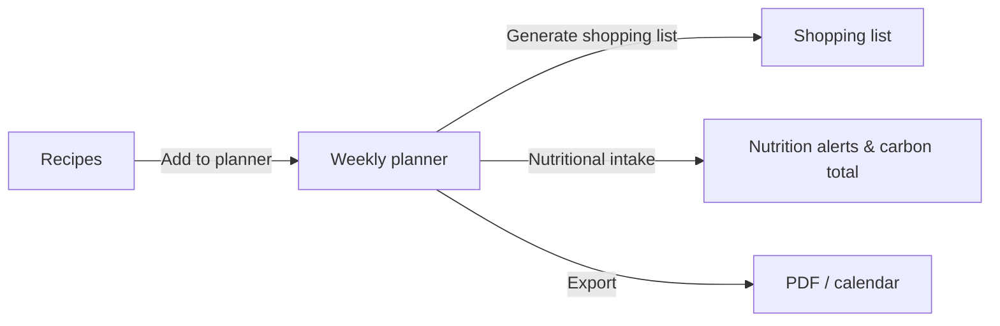

# Cocotte

{ width="120" }

**Store your recipes, plan your week, and see the nutrition and carbon footprint of every meal.**

Cocotte is an open-source recipe manager and weekly meal planner. You can write recipes by hand,
import them from a URL or paste them as Cooklang. Then you can search them by ingredient, season,
diet, cooking time or carbon impact, plan them over a week, and turn that week into a shopping
list.

Every recipe carries its nutrition facts and an estimate of its carbon footprint (kg CO₂e). The
planner adds these up so you can see what a week of meals means for your body and for the
planet.

## What you can do with Cocotte

| Feature | What it does |
|---|---|
| **Recipes** | Manual entry, import from a recipe website, or paste Cooklang. Add a picture, a YouTube video and a link to the source. Download any recipe as a PDF. |
| **Variants** | Fork a recipe into a variant such as "Gluten-free" or "Spicier". It stays linked to the original. |
| **Search & filters** | Search by text, ingredients, diet, prep and cook time, carbon impact per serving and seasonality. Filtered views are plain URLs that you can bookmark or share. |
| **Meal planner** | Week and month views, servings per meal, allergen warnings, nutrition alerts, the week's carbon footprint, PDF export and calendar subscription (.ics / Google Calendar). |
| **Shopping lists** | Generated from your planned meals. Ingredients are added up and scaled to the servings you planned. You can tick items off in the shop, even offline. |
| **Allergies & intolerances** | Declare them in your profile. Recipes that contain them are hidden from the list by default, and the planner warns you when you schedule one. |
| **Nutrition & carbon** | Per-serving macronutrients plus iron, vitamin B12, calcium, omega-3 and zinc. Weekly deficiency alerts depend on your diet and activity level. |
| **Bilingual PWA** | French and English interface, light and dark themes, installable on phones and desktops, with offline reading. |

## A quick tour

### Find something to cook

The recipe list has a filter drawer. The dice button picks a random recipe for you when you
can't decide.

### Cook from a recipe

Each recipe page has ingredient links inside the steps, one-tap timers, nutrition facts per
serving and the carbon footprint.

### Plan the week, then shop

## Where to go next

- **Try it on your computer**

    ---

    Install Cocotte with Docker or with a classic Python + Node setup.

    [Installation](getting-started/installation.md)

- **First run**

    ---

    Create the database, an admin account and the reference data. Then log in.

    [First run](getting-started/first-run.md)

- **Learn the interface**

    ---

    A tour of the navigation, your account menu and what visitors can do without an account.

    [User guide](user-guide/index.md)

- **Host it for real**

    ---

    Deploy Cocotte on a server with HTTPS, using the production Docker stack.

    [Production deployment](admin-guide/deployment.md)

## Project

- [Changelog](changelog.md): what changed in each version.
- [How to contribute](developer/contributing.md): report bugs, suggest features and send pull requests.
- The source code is on [GitHub](https://github.com/jacquesfize/cocotteapp).

> [!NOTE]
> Nutrition and carbon figures are estimates based on category-level averages (Open Food Facts,
> Agribalyse, Poore & Nemecek). They are not medical advice or a certified carbon audit. See
> [Nutrition & carbon](user-guide/nutrition-and-carbon.md) for details.
