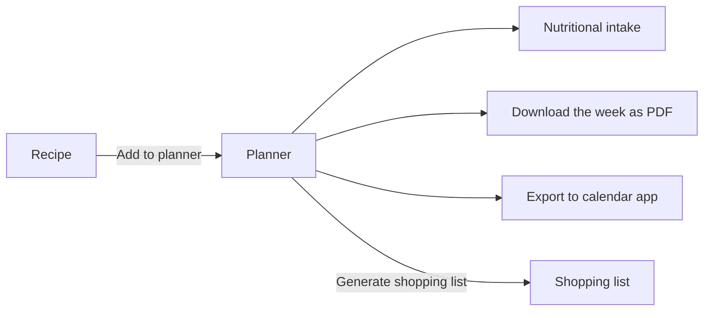

# Meal planning

The **Planner** is where you organise your meals over the week or the month. From it you can
check your nutrition and carbon footprint, print the week, add your meals to your calendar
app and generate a shopping list. You need to be logged in.

Click **Planner** in the top bar (or in the bottom tab bar on a phone).

## Week and month views

The **Week** / **Month** buttons at the top switch between the two views.

**Week view**
:   A row of seven day buttons (Monday to Sunday) sits above the grid. Click one to show that
    day, with **Breakfast**, **Lunch** and **Dinner** as rows. Each row lists the recipes planned
    for that meal; click a recipe to open it. The planner opens on today, and today's day button
    and cells are tinted so you can spot them at a glance. The layout is the same on a computer
    and on a phone.

> [!NOTE]
> The instance administrator can also enable a fourth row, **Snack**, for everyone on the
> instance (off by default). If you don't see it, ask your administrator — see
> [Configuration](../admin-guide/configuration.md#planning-and-nutrition-features).

**Month view**
:   A calendar of the whole month, listing the recipes planned each day with an icon for the
    meal (☀️ breakfast, 🥗 lunch, 🌙 dinner). A day shows up to three recipes; click **+N more** or
    the **day number** to open that day in the week view. On a phone, each day only shows dots
    for its planned meals. Today's date is highlighted.

Use the **‹** and **›** arrows around the date range to move to the previous or next week (or
month). When you are not on the current period, a **Today** button next to the date range
brings you back.

> [!IMPORTANT]
> The buttons at the bottom of the planner apply to **the period currently displayed**: the week
> in week view, the **whole month** in month view. This covers the nutrition summary, the PDF,
> the .ics download and the shopping list.

## Add a meal

### From the planner

1. In week view, pick the day, then click the **+** in the row of the meal you want. In a row
   that already has a recipe, the **+** appears under it when you hover the row. This opens the
   **Add a meal** dialog.
2. Type part of a recipe's title in **Search a recipe...** and click it in the list. Or click
   **Surprise me** to get a random recipe.
3. Set the number of **Servings** (it starts at the recipe's own number of servings). Click
   **Choose another recipe** to go back to the search.
4. Click **Add**. Use **Cancel**, **×**, or click outside the dialog to close it without
   adding.

You can plan several recipes for the same meal, for example a main course and a dessert.
You can't add the same recipe twice to the same meal on the same day. If you try, you see
*Could not add this entry (date already planned for this recipe and meal?).*

### From a recipe

Every recipe page has an **Add to planner** card. Pick a **Date**, a **Meal** and the
**Servings**, then click **Add**. See
[Add to the planner](browsing-recipes.md#add-to-the-planner). The
[Random recipe](browsing-recipes.md#random-recipe) page has the same card.

### Servings

The servings you set for a meal are what count for nutrition, carbon and shopping lists.
Cocotte scales each recipe by *planned servings ÷ recipe servings*. For example, a recipe
written for 4 and planned for 2 counts as half the recipe.

To change the servings of a planned meal, remove it and add it again with the new number.

## Move or copy a meal

Drag a recipe onto another meal row to move it there. To move it to another day, drop it on that
day's button above the grid (it keeps the same meal, for example lunch stays lunch). In month
view, drag a recipe onto another day. Hold **Alt** while dropping to copy the recipe instead of
moving it.

> [!NOTE]
> Drag and drop needs a mouse or trackpad. On a phone, remove the meal and add it again.

## Remove a meal

Hover the recipe and click the small **×** in its corner (on a touch screen it's always
visible). The meal is removed right away, and a message at the bottom of the screen offers
**Undo** for a few seconds.

## Allergen warnings

If a recipe contains one of the allergies or intolerances from your profile, a warning appears:

- under the recipe in the planner cell,
- in the **Add a meal** dialog as soon as you pick the recipe.

**Contains:** lists your allergies and **May bother you:** lists your intolerances. The warning
doesn't stop you from planning the meal. Set your allergens in
[Your account](account.md#allergies-and-intolerances).

## Nutritional intake and carbon footprint

Click **Nutritional intake** at the bottom of the planner to open a summary of the displayed
period:

- **Possibly insufficient intake this week** lists each nutrient whose **daily average** falls
  below your daily minimum, as *nutrient : your average / minimum unit*. This section only
  appears if the instance administrator has turned the feature on (off by default — see
  [Configuration](../admin-guide/configuration.md#planning-and-nutrition-features)).
- **This week's carbon footprint** is the total kg CO₂e of all the planned meals, scaled to
  their servings. This is always shown, regardless of the deficiency-alerts setting.

> [!NOTE]
> The daily average is spread over **every day of the period**, including days with nothing
> planned. If you only plan dinners, or only a few days, you will see alerts: the summary only
> knows about what's in the planner. Minimums depend on the diet and activity level in your
> profile. See [Nutrition & carbon](nutrition-and-carbon.md#weekly-deficiency-alerts).

The home page's **This week** strip also shows a badge with the number of alerts for the next
seven days.

## Download the week as PDF

Click **Export**, then **Download the week as PDF** (**Download the month as PDF** in month
view) to get a printable PDF of the displayed period
(`agenda-START-END.pdf`). It contains the meal grid plus the full detail of every recipe in it.
You can take it to the kitchen or to the shop.

## Export to calendar

Click **Export** at the bottom of the planner to add your meals to Google Calendar, Apple Calendar, Outlook or
any calendar app that reads iCalendar (.ics).

Each meal becomes a one-hour event titled with the recipe's name, at a fixed time:

| Meal | Time |
|---|---|
| Breakfast | 08:00 |
| Lunch | 12:30 |
| Snack | 16:00 |
| Dinner | 19:30 |

### One-off download

**Download the week as .ics file** saves the displayed period as a file. Open it with your
calendar app to import the events. This is a snapshot: later changes in Cocotte don't reach
your calendar.

### Subscription (updates automatically)

A subscription keeps your calendar in sync with your **whole** planner, past and future.

- **Copy subscription URL** copies your personal feed address. In your calendar app, add a
  calendar "from URL" or "by subscription" and paste it.
- **Add to Google Calendar** opens Google Calendar with the subscription ready to confirm.

Calendar apps refresh subscriptions on their own schedule, which can take from a few minutes to
a day, depending on the app.

> [!WARNING]
> This URL is secret: anyone who has it can read your meal plan, without logging in. Don't
> share it.

### Regenerate the URL

If the URL has leaked, or you want to disconnect every calendar using it, click **Regenerate
URL** and confirm. The old address stops working immediately. Calendars subscribed with it
stop updating, so subscribe again with the new one.

## Shared agendas

Other people can share their planner with you, and you can share yours. Sharing is set up in
**My account** → **Share my agenda** (see
[Your account](account.md#share-my-agenda)).

When someone has shared their agenda with you, a **Displayed agenda** selector appears at the
top of your planner:

- **My agenda**: your own planner,
- ***Name*'s agenda (read only)**: you can see their meals, nutrition summary and PDF, but not
  change anything. The add and remove buttons are hidden, and meals can't be dragged.
- ***Name*'s agenda (read & write)**: you can also add and remove meals in their planner.

The nutrition alerts of a shared agenda are computed with **its owner's** diet and activity
level.

> [!NOTE]
> Shopping lists can only be generated from **your own** agenda. With someone else's agenda
> selected, the generated list comes out empty. Ask the owner to generate it, or plan the meals
> in your own agenda. Likewise, the calendar subscription in the **Export** menu always covers
> your own planner.

## Generate a shopping list

Click **Generate shopping list** at the bottom of the planner. The line above it shows how many
meals are planned in the displayed period (for example *2 meals planned this week*). The button
is disabled when there are none.

Cocotte creates a new shopping list from **all the meals of the displayed period** and opens
it. Ingredients are added up across recipes and scaled to the servings you planned. See
[Shopping lists](shopping-lists.md).

> [!TIP]
> To shop for only part of the week, remove the meals you don't need yet, generate the list,
> then add them back. Or shop from the month view to cover several weeks at once.
